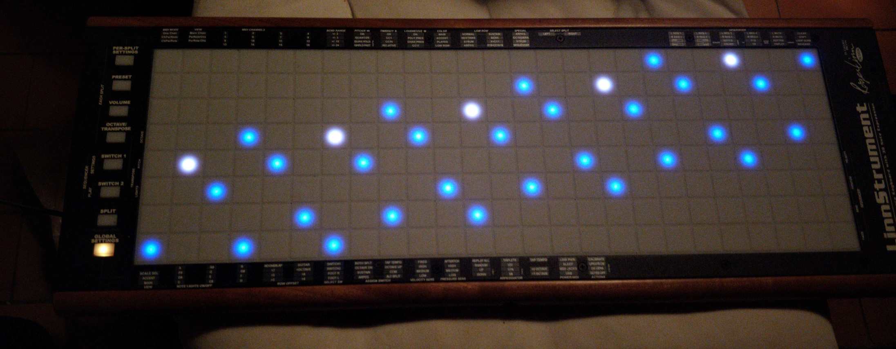

2D microtonal layouts for Linnstrument. Automatically generates layout and led highlights.

You need to install [Love2D](https://love2d.org/) and some kind of midi loopback driver (e.g. [loopmidi](https://www.tobias-erichsen.de/software/loopmidi.html)) for this to work.

There's a precompiled version of RtMidi included for Windows, you'll need to compile it yourself for MacOS / Linux.

Code is not really maintained, but it should provide a good starting point for how to interact with the Linnstrument in ["user firmware mode"](https://github.com/rogerlinndesign/linnstrument-firmware/blob/master/user_firmware_mode.txt). 

